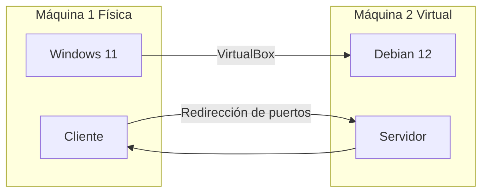

# Lógica de operacion
En este curso se estará trabajando con dos maquinas, ya sean del mismo o distinto sistema operativo. En los ejemplos y guías de
este repositorio tendremos como sistema principal **Windows 11** y como secundario una **Máquna Virtual** con **Ubuntu Debian 12**.
## Requerimientos tecnológicos
* Máquina física con Windows 11.
* Virtual Box instalado.
* Imágen de Ubuntu Debian 12
## Diagráma de trabajo

